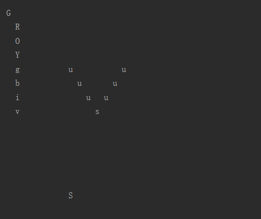

# homework3

#### G代表老爷爷，R O Y g b i v 分别为葫芦七兄弟
#### u为小喽啰、S为蛇精、s为蝎子精
#### Control为主类，定义了五种阵法longsnake();cranewing();gooseflying(); sharpvow();henge();
#### Creature.java文件中，Grandfather， Calabash， Scorpion， Snake， Underling均为Creature的子类。
#### Map类主要用于改变地图信息和打印地图。
