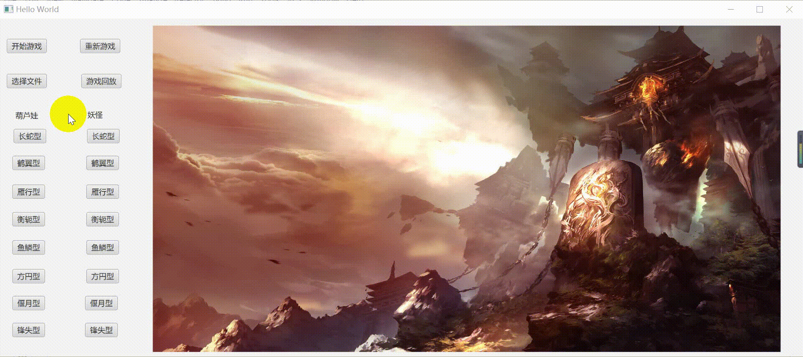

# Final Project 葫芦娃大战妖精#
## 效果展示 ##
### 
## 功能介绍 ##
### 选择阵型 ###
点击屏幕上的阵型名字，即可切换阵型。
### 开始战斗 ###
按空格键或者点击屏幕上开始游戏，即可开始战斗。
### 视频回放 ###
在没有进行战争的时候点击选择文件或者按L键，选择要重放的录像，点击游戏回放进行录像查看。
### 文件保存 ###
在每一次结束战斗后，则会在files文件夹里面自动创建txt文件存储战斗过程。
## 实现说明 ##
### 数据结构的实现 ###
延续了以前作业的一些数据结构，并添加了一些新功能
#### Creature类 ####
    public class Creature implements Runnable, Serializable{...}
定义每一个生物体都是一个线程，重载run()函数，并且利用synchronized关键字实现多线程之间的同步。

#### HuluBrother类 ####
    HuluBrother extends Creature{
	private static BattleField BattleFieldcreature;//战场信息
    private static int em = 0;//死锁次数
    protected String name;//名字
    private int x;//所在位置x坐标
    private int y;//所在位置y坐标
    private boolean isalive=true;//是否存活
    protected boolean goodcreature = true;//是否为好人
	...}
是Creature的派生类，多了葫芦娃的枚举类型和颜色的枚举类型。
#### LouLuo和XieZi类 ####
    class LouLuo extends Creature{...}
    class XieZi extends Creature{...}
是Creature的派生类,改变了默认的好人属性。
#### Grandpa和SheJing类 ####
	public class Grandpa extends Creature implements Cheer {...}
    public class SheJing extends Creature implements Cheer {...}
是Creature的派生类,同时实现了Cheer接口，有助威的功能。
#### HuluBrothers和Monsters类 ####
	public class HuluBrothers {
    private Creature[] Hulu = new HuluBrother[7];//初始化构造七个葫芦娃
	...}
	public class Monsters {
    final int LouLuoN = 7;
    private Creature[] monsters = new Creature[LouLuoN];
	...}
分别包含葫芦娃和小喽啰。
#### BattleField类 ####
	public class BattleField implements Serializable {
    private Position[][] Field;
    private int M = 10;
    private int N = 18;
    private int goodnum;
    private int badnum;
	...}
保存战场信息。
#### Position类 ####
	public class Position implements Serializable {//position
    private int X;
    private int Y;
    public Creature creature;
	...}
存放战场上生物的信息。
#### Formation接口 ####
	public interface Formation {
    boolean ifEmpty(Position[][] Field,int x,int y);
    void setCreatures(Position[][] Field,int x,int y, Creature[] creatures);
	}
然后八个队形分别实现这两个接口。
### GUI画面的实现 ###
	public class Main extends Application {...}
	public class Controller {...}
设计sample.fxml文件，同时在Controller类中实现相应的操作代码，完成图形界面。
## 面向对象的原则 ##
### 封装 ###
将生物类中的属性全部私有化，只有通过自己的方法才能操作它们的数据。
### 继承 ###
葫芦娃、爷爷、小喽啰、蛇精、蝎子精继承生物类，获得基本的属性和方法，并且可以添加自己独有的属性和方法。
### 多态 ###
子类重新实现了生物类的方法，则运用了多态机制。
### 开放封闭原则 ###
也就是说模块的行为是能够被扩展的。当应用程序的需求变化时，我们可以使模块表现出全新的或与以往不同的行为，以满足新的需求。模块的源代码是不能被侵犯的，任何人都不允许修改已有源代码。则创建接口，通过实现接口来实现不同的方法，像八个阵型的实现方法。
## 机制 ##
### 异常处理机制 ###
存入文件时
	
	try {
		savefile();//存入文件
	} catch (IOException e{
		e.printStackTrace();
	}

### 集合类型 ###
存入战场信息，以便游戏回放。

	ArrayList<BattleField> bfs = new  ArrayList<BattleField>();
### 注解 ###
与fxml绑定
	
	@FXML
    public ImageView hulu11;
    @FXML
    private Canvas hulucanvas;
    @FXML
    private GraphicsContext gc;

代码的复用

	@Override
    public void run() {...}

### 输入输出 ###
利用Java的文件序列化和反序列化机制，进行对战场信息的存储。

	FileOutputStream fileInputStream = new FileOutputStream(filesave);//存文件
    ObjectOutputStream objectOutputStream = new ObjectOutputStream(fileInputStream);
    for(BattleField c:bfs)
            objectOutputStream.writeObject(c);
	FileInputStream fileInputStream = new FileInputStream(fileopen);//读文件
    ObjectInputStream objectInputStream = new ObjectInputStream(fileInputStream);
    bfs.clear();
    while (fileInputStream.available() > 0) {
        BattleField a=(BattleField) objectInputStream.readObject();
        bfs.add(a);
    }

## 多线程间的协同问题 ##
将每个生物都看成是一个线程。并重写了run方法，利用synchronized关键字实现多线程同步。
	
	public class Creature implements Runnable, Serializable {
		@Override
    	public void run() {
			while(isalive&&BattleFieldcreature.getgoodnum()>0&&BattleFieldcreature.getbadnum()>0){
            	synchronized(this) {...}
			}
		}
	}
## 一些思考和踩过的坑 ##
### 作战模式 ###
在写游戏的时候，直接使用了面对面的作战模式，即只有两个生物靠在一起才可能有作战的可能。并且每个生物有着相同的胜率，准确来说这是一场看运气的比赛，使用随机数来决定谁输谁赢。使用的行走模式，是使用的查看东西南北哪边有敌人，则向那边走，但是因为一次只能走一步，则有时会出来死锁现象，则设置一个变量，当死锁时间过长时，则生物可以随意走动，这样在一定程度上缓解了死锁的现象。
### 文件存储 ###
在写完了GUI和多线程时，以为轻轻松松的就能写好文件系统交作业了，可是没想到消耗了大半天在文件的存入上面。因为自己创建了一个动态数组，然后准备将动态数组里面的内容通过文件序列化传进去，然后通过反序列化读出来。可是后来发现一直不对，发现数组中的所有元素都和最后传入的战场信息一致，一直都没想出这个是为什么。后来想了想是不是因为没有new一个新的对象直接把原来的地址传进去了呢。于是new了新的作战信息的类同时看到了以前的默认构造函数，也new了里面的Position类。可是后来怎么跑都还是不正确，就不知道自己犯了什么错。后来突然注意到在Position的构造函数里面直接给他的creature成员直接赋值了，果然问题还是没有new，而且是没有new类的成员类的成员类。警醒自己以后一定要记得，成员函数的初始化，赋值操作等，不能直接用等号。
### 屏幕的刷新 ###
整个屏幕的刷新是在博客上看到的一个通过timer创建线程的方法实现的。

## 结语 ##
写了大作业以后Java的的确确是一门面向对象的语言，将所有的物体都抽象为类，有一双上帝之手，来创造一个开启类创建实例化对象，来实现各种功能。Java真的是一门需要仔细去研究的语言。有点悔恨自己没有花很多时间在上面，也因为自己的拖延症导致了作业到ddl来临前才想着要交。最后，要谢谢carry我的同学，谢谢晚上还在答疑的助教，当然最感谢的是两位老师的辛勤付出，虽然严厉了一点，可是这会让我们在以后写Java的路上受益匪浅，谢谢！

	
