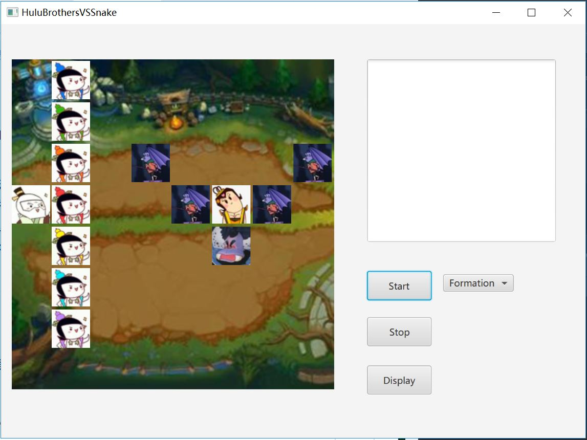
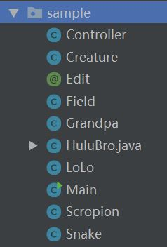
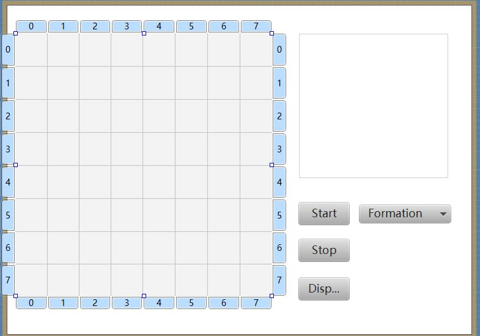
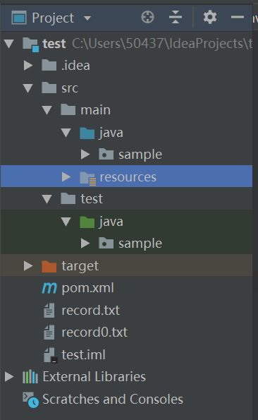
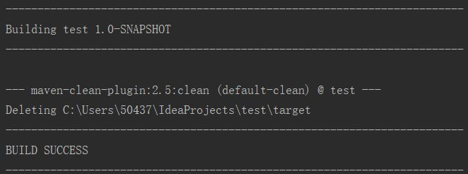
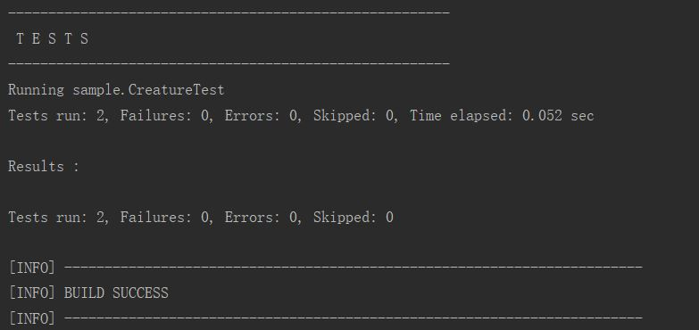
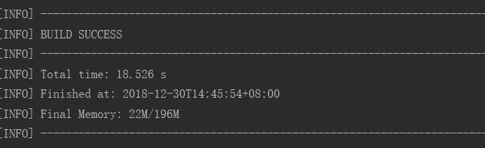

# Java大作业说明
## 效果展示

## 一. 使用介绍
### 1.点击Start按钮后即可开始游戏，开始游戏前课选择阵型（在Formation的菜单栏里面选择）；
### 2.点击Stop按钮，暂停游戏；
### 3.点击Display按钮，选择文件进行播放（保存的一次记录文件为Record0.txt)；
### 4.点击Formation菜单栏，里面有蛇精阵营的八种阵型可供选择。

## 二. 设计思路
### 本次大作业的设计主要分为三个大类：
#### · Main类，进入GUI，Javafx自动生成，无额外功能；
#### · Controller类，主要进行GUI的设置，像按键的设置，人物图片的显示等；
#### · Creature类，以此为基类而有HuluBro，Grandpa，Snake，Scropion, LoLo类，主要进行人物行为等功能；
#### · Field类，主要对战场信息的保存，供GUI根据该信息显示。

## 三. 具体设计

### 1. Controller类（主要函数及功能）：
#### · initialize函数：初始化战场；从资源文件中获取每个人物的图片信息；设置界面的菜单栏选项；
#### · startNewGame函数：响应按键Start，使各个生物类的线程run起来，从而开始游戏；
#### · stopThisGame函数：响应按键Stop，使各个生物线程暂停，游戏暂停；
#### · refresh函数：其中会调用clearAll和showField函数，前者清空GUI上的图片，后者重新显示，达成刷新界面的效果，每当战场信息发生改变时，refresh函数响应消息，完成界面刷新；
#### · changeIcon: 当然有人战死战场时，响应图标会发生改变，调用此函数；
#### · displayRecord: 响应按键Display, 完成打开文件，调用播放记录函数；

### 2. GUI设计：

#### · Gridpane: 左侧半部分，为8*8的网格，显示战斗界面；
#### · TextArea: 右上部分，是文字输出框，打印战斗相关的文字信息；
#### · Button(Start, Stop, Display): 按钮功能
#### · MenuButton(Formation)，菜单选择，选取阵型
#### 设计方法：借助JavaFX Scene Builder图形化界面设计工具，设计GUI并产生相应的资源文件sample.fxml，在项目中读取该资源文件后，便能够显示所设计的界面了。

### 3. Creature类（具体函数及功能）
#### 在此类中实现了接口Runnable，重现了run函数，使得每一个生物都有独立的线程，相互独立地完成移动、攻击等动作，具体如下：
#### · 保存信息：存活与否alive, 位置坐标（cor_x, cor_y），攻击力（attack), 名字（name), 战斗与否（isBattling), 以及获取和设置这些信息的set,get函数；
#### · moveTo函数，从一个地点移动到另一个地点的函数，函数内部会判断目标地点是否有人、物占位而不能移动，若成功移动则输出相关信息，因为访问位置信息会出现同步问题，所以这里对这个函数的访问加了synchronized处理；
#### · battle函数，一个生物可以选择另一个生物进行攻击，也会根据是否满足攻击条件（对方未阵亡，未处于攻击状态，属于敌方阵营等条件），根据攻击力大小，按相应的概率得到攻击结果，由于访问攻击条件信息会出现同步问题，所以这里也对这个函数的访问加了synchronized处理；
#### · 重写run函数，每个生物体的战斗逻辑主要是：若前方无敌人（攻击范围是正前方，前上方和前下方三个位置），则向前进一格，否则，判断能否攻击敌人而决定攻击与否。若抵达对方阵营“大本营”（最后一列），则会用有攻击无视范围的效果，可以选择敌方任一对象攻击；
#### · start函数，开启线程；
#### · stop函数，暂停线程；
#### · HuluBro，Grandpa, Snake, Scropion, LoLo均继承自Creature类。

### 4. Field类（具体函数及功能）
#### 在此类中完成了存储战场信息、判断胜负双方、播放战斗记录的功能，具体如下：
#### · 战场信息包括：8*8的网格上人物的位置信息，双方阵营的人物信息（brothers[7], grandpa, snake, scropion, LoLo[])，以及关于这些位置信息的set,get函数;
#### · 构造函数：初始化战场，生成7个葫芦娃，老爷爷，蛇精，蝎子精和小喽啰，安排阵型；
#### · countAliveOfHulu(Snake)函数：计算双方阵营的存货人数，以判断胜负；
#### · print函数：在界面的TextArea上打印战场上人物移动，battle信息；
#### · changeFormation: 改变阵型；
#### · display：读取文件，播放战斗过程，其中，会调用getObjByName函数，因为记录文件中只会记录下人物姓名，而getObjByName可以通过姓名找到人物对象，从而便于播放记录。

### 5. 战斗思路
#### 若前方无敌人（攻击范围是正前方，前上方和前下方三个位置），则向前进一格；
#### 否则，判断能否攻击敌人而决定攻击与否；
#### 若抵达对方阵营“大本营”（最后一列），则会用有攻击无视范围的效果，可以选择敌方任一对象攻击；
#### 攻击结果的判定：根据攻击力的对比，设置概率(攻击越高，获胜概率越大)，由程序根据概率获得一个随机数，根据随机数结果判定战斗结果。
#### 攻击力设置：葫芦娃[90,80,70,60,50,40,30],老爷爷[20]，蛇精[75]，蝎子精[45]，小喽啰[15]。

## 四. 大作业的要求相应体现
### 1. 项目总结构

### 2. 图形化框架JavaFx
#### 使用JavaFX, 借助SceneBuilder生成FXML文件,完成图形化

### 3. 面向对象编程方法，体现封装，继承和多态和设计原则
#### 本项目中每个生物体是一个对象，战场是一个对象，GUI控制是一个对象，三者的关系GUI控制（Controller)中产生一个战场对象（field），field中产生所有的生物体（creature）对象；
#### 所有对象的私人信息都被修饰了private，获取和设置相关信息需要调用提供的接口getXXX,setXXX函数，体现了封装，体现了开放封闭原则；
#### 每个生物个体都继承了Creature，体现了继承，每个需要Creature的地方都可以用它的子类对象替代，且程序结果一致，体现了里氏替代原则；
#### 在Creature类的battle函数中，参数为Creature类的对象，但实际传参时，传的是Creature的子类对象，根据子类对象会作运行时相关检查，且在子类中重写父类的方法，运行时动态绑定子类方法，体现了多态性；
### 4. 异常处理
#### 在进行线程的相关操作时，会catch InterruptedException; 打开文件时，会catch FileNotFoundException; 在进行文件读写的相关操作时，会catch IOException等异常处理；
### 5. 注解
#### 自定义了一个注解，public @interface Edit{}, 主要用于记录每部分代码的修改时间；
### 6. 文件输入输出
#### 采用文件流的方法读取文件，br = new BufferReader(new InputStreamReader(new FileInputStream(file.getPath()))) 将文件读入到缓存区中，然后从缓冲区中每次读取一行信息 br.readLine(); 采用文件流的方法输出文件，（FileOutputStream)output.write(bytes)
### 6. 单元测试用例
#### 测试Creature类：CreatureTest.class
### 7. maven构建
#### · 执行mvn clean

#### · 执行mvn test

#### · 执行mvn package

